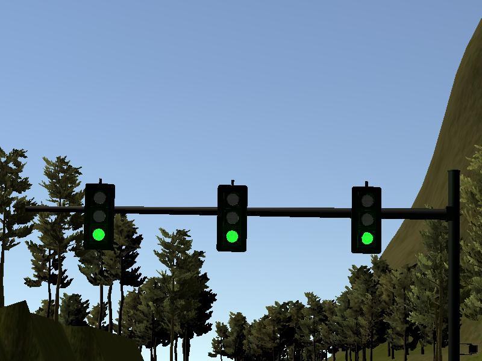

# Traffic Light Classifier

## _Traffic light detector module of the capstone project of Self-Driving Car Engineer Nanodegree_

[](http://www.udacity.com/drive)  

This repository documents the procedures on training a SSD (Single Shot Detector) model for traffic light state classification using learning transfer from pre-trained MobileNet models using Google TensorFlow Object Detection API.

For details about the capstone project, please refer to the GitHub [repo](https://github.com/bitsurgeon/CarND_Capstone).

---

## Environment

- clone TensorFlow object detection model [repo](https://github.com/tensorflow/models.git)
- install the model following the official [guide](https://github.com/tensorflow/models/blob/master/research/object_detection/g3doc/installation.md)
- suggest to use [`conda`](https://docs.conda.io/en/latest/miniconda.html) for TensorFlow installation, this is the [environment file](https://gist.github.com/bitsurgeon/7a0ef420c79ad882b628746174c9e8b7)
  - TensorFlow v1.14 is used for capstone model training
- this [troubleshooting](https://github.com/alex-lechner/Traffic-Light-Classification#troubleshooting) guide can be helpful
- assuming [ROS Kinetic](http://wiki.ros.org/kinetic/Installation/Ubuntu) has been installed

## Dataset

Images from simulator and test site need to be collected in this step.

- Simulator: save camera images in the callback function for `/image_color` ROS topic.
- Site: extract images from rosbag provided by Udacity.

To save images from rosbag, make sure `image_view` has been installed with ROS Kinetic packages, or it can be installed with the following command:  

```sh
sudo apt-get install ros-kinetic-image-view
```

Use the following commands to capture the images:

```sh
# 1st terminal
roscore

# 2nd terminal
rosbag play -l path/to/your_rosbag_file.bag

# 3rd terminal
rosrun image_view image_saver image:=/image_raw
```

Select images with traffic light in different distance and states for training. Make sure the numbers of different color states are balanced.

Here are two example images for the site and simulator:

  


In addition to the images captured in above, publicly available datasets can be incorporated to derive better models.

- Bosch Small Traffic Lights [Dataset](https://hci.iwr.uni-heidelberg.de/node/6132)
- Past Udacity Student - [Alex](https://www.dropbox.com/s/vaniv8eqna89r20/alex-lechner-udacity-traffic-light-dataset.zip?dl=0)
- Past Udacity Student - [Vatsal](https://github.com/coldKnight/TrafficLight_Detection-TensorFlowAPI#get-the-dataset)

## Labeling

This is probably the most time consuming and boring step in the whole model training process. But please don't get fooled. How well the images get labeled in this step will have direct effect on the model accuracy at the end.

Among many image labeling [tools](https://hackernoon.com/the-best-image-annotation-platforms-for-computer-vision-an-honest-review-of-each-dac7f565fea), the one I used is [labelImg](https://github.com/tzutalin/labelImg). It's interface is pretty straightforward, and easily to get job done.

Annotations are saved in  `.xml` file. And it is in [PASCAL](http://host.robots.ox.ac.uk/pascal/VOC/) format, which is the same format used by [ImageNet](http://www.image-net.org/). Each image will have its own annotation file in `labels` folder. Each light state can have its own folders.


Note that the labeled image from Bosch dataset is in `.yaml` file format.

## TFRecord

A [TFRecord](https://www.tensorflow.org/api_guides/python/python_io#tfrecords_format_details) file is needed to retrain a TensorFlow model. It is a binary file that stores images and ground truth annotations. All necessary scripts are provided by TensorFlow.

The following items are required to generate a TFRecord file:

- a [`label_map.pbtxt`](./label_map.pbtxt) file that contains the labels (e.g. Red, Green or Yellow) with an associated ID (which must start from 1 instead of 0)
- the labeled `.xml` files
- script `create_tf_record.py` from TensorFlow [dataset tools](https://github.com/tensorflow/models/tree/master/research/object_detection/dataset_tools)

For this project, a new [script](./create_capstone_tf_record.py) is created to generate our TFRecord file.

```sh
python object_detection/dataset_tools/create_capstone_tf_record.py --data_dir=path/to/green/lights,path/to/red/lights,path/to/yellow/lights --annotations_dir=labels --output_path=your/path/to/train.record --label_map_path=path/to/your/label_map.pbtxt
```

The generated TFRecord file is expected to be similar size as the total size of the images.

If Bosch dataset is used, please refer to this [link](https://medium.com/@WuStangDan/step-by-step-tensorflow-object-detection-api-tutorial-part-2-converting-dataset-to-tfrecord-47f24be9248d).

## Model

Detection [Model Zoo](https://github.com/tensorflow/models/blob/master/research/object_detection/g3doc/detection_model_zoo.md) provides many options of pre-trained models. The inference speed and accuracy information are provided as well.

The following models are selected for capstone project:

- simulator: SSD Mobilenet V2 coco 2018/03/29
- site: SSD Inception v2 coco 2018/01/28

Follow links to download the models, and unzip the package with

```sh
unzip with tar -xvzf your_tensorflow_model.tar.gz
```

Each model contains:

- a checkpoint (`model.ckpt.data-00000-of-00001`, `model.ckpt.index`, `model.ckpt.meta`)
- a frozen graph (`frozen_inference_graph.pb`) to be used for out of the box inference

To re-train the model, a config file (`pipeline.config`) is needed, and can be downloaded [here](https://github.com/tensorflow/models/tree/master/research/object_detection/samples/configs).

Some of the configurations in the config file are required to be updated according to your situation:

- change `num_classes: 90` to the number of labels in your `label_map.pbtxt`
- Set the default `max_detections_per_class: 100` and `max_total_detections: 300` values to a lower value for example `max_detections_per_class: 10` and `max_total_detections: 10`
- Change `fine_tune_checkpoint: "PATH_TO_BE_CONFIGURED/model.ckpt"` to the directory where your downloaded model is stored e.g.: `fine_tune_checkpoint: "models/your_tensorflow_model/model.ckpt"`
- Set `num_steps: 200000` down to `num_steps: 20000`
- Change the `PATH_TO_BE_CONFIGURED` placeholders in `input_path` and `label_map_path` to your `.record` file(s) and `label_map.pbtxt`

There is a [paper](https://arxiv.org/abs/1611.10012) discussed the parameter settings in detail.

If you don't want to use evaluation/validation in your training, simply remove those blocks from the config file. However, if you do use it make sure to set `num_examples` in the `eval_config` block to the sum of images in your `.record` file.

For more details on `.config` file setting, please refer to this [guide](https://github.com/tensorflow/models/blob/master/research/object_detection/g3doc/configuring_jobs.md).

## Training

The models were trained on [AWS](https://aws.amazon.com/) EC2 p3.2xlarge instance with a Tesla V100 GPU. Note, you may need to request limit increase with AWS support before you can access.

The latest Ubuntu 18.04.3 LTS image was used, and the environment setup was followed the previous sections.

Upload the dataset and models to AWS instance in `models` and `data` folders.

The following script can be used to train the model:

```sh
# this for earlier version of the API
python object_detection/train.py --logtostderr --train_dir=./models/train --pipeline_config_path=./config/your_tensorflow_model.config
```

Please follow this [guide](https://github.com/tensorflow/models/blob/master/research/object_detection/g3doc/running_locally.md) for latest model fine-tuning steps. The script currently in use is [`model_main.py`](https://github.com/tensorflow/models/blob/master/research/object_detection/model_main.py).

An example training command:

```sh
python object_detection/model_main.py --pipeline_config_path=object_detection/models/ssd_mobilenet_v2_coco_2018_03_29/ssd_mobilenet_v2_coco.config --model_dir=object_detection/models/ssd_mobilenet_v2_coco_2018_03_29/capstone_model --num_train_steps=50000 --sample_1_of_n_eval_examples=1 --alsologtostderr
```

It is recommend to train both models with at least 20,000 steps in sum.

Also, to reduce memory requirements during training:

- update the following parameters in `train_config` section
  - `batch_queue_capacity: 2`
  - `prefetch_queue_capacity: 2`
- this will result in a slower training progress

[Tensorboard](https://www.tensorflow.org/get_started/summaries_and_tensorboard) can be used to monitor the training progress.

Note: `data_augmentation_option` is very interesting if your dataset doesn’t have much of variability like different scale, pose. A full list of options can be found [here](https://github.com/tensorflow/models/blob/a4944a57ad2811e1f6a7a87589a9fc8a776e8d3c/object_detection/builders/preprocessor_builder.py) (see `PREPROCESSING_FUNCTION_MAP`).

## Export

The re-trained model need to be exported as a frozen graph for deployment.

The capstone project requires to export the graph in TensorFlow v1.3 compatible. The model export function is supported in v1.4, and it is v1.3 compatible.

Setup a separate conda environment with TensorFlow v1.4 and Python v3.6 for graph export.

This is the official [guide](https://github.com/tensorflow/models/blob/master/research/object_detection/g3doc/exporting_models.md) for exporting the model.

Here is an example run

```sh
python object_detection/export_inference_graph.py --input_type=image_tensor --pipeline_config_path=object_detection/models/ssd_mobilenet_v2_coco_2018_03_29/ssd_mobilenet_v2_coco.config --trained_checkpoint_prefix=object_detection/models/ssd_mobilenet_v2_coco_2018_03_29/capstone_model/model.ckpt-1000 --output_directory=object_detection/models/ssd_mobilenet_v2_coco_2018_03_29/capstone_model/frozen/
```

In the final project, the graph need to be exported with TensorFlow v1.4 to work with Carla:

- For SSD Inception, checkout [1f34fcaf](https://github.com/tensorflow/models/blob/1f34fcafc1454e0d31ab4a6cc022102a54ac0f5b/research/object_detection/g3doc/installation.md).
- For SSD MobileNet, checkout [001a2a6](https://github.com/tensorflow/models/blob/001a2a61285e378fef5f45386f638cb5e9f153c7/research/object_detection/g3doc/installation.md).
- The config file might need to be updated for successful export.
- This [discussion](https://github.com/tensorflow/tensorflow/issues/16268) on GitHub relating to `exporter.py` script might be helpful.
- The `proto` lib might need to be rebuild.

The frozen graph for site and simulator can be found [here](https://github.com/bitsurgeon/CarND_Capstone/tree/master/ros/src/tl_detector/light_classification/model/site_ssd_inception_v2_coco_2018_01_28_39747_v1_4) and [here](https://github.com/bitsurgeon/CarND_Capstone/tree/master/ros/src/tl_detector/light_classification/model/sim_ssd_mobilenet_v2_coco_2018_03_29_28930_v1_4).

## Inference

Test with the Jupyter [notebook](https://github.com/tensorflow/models/blob/master/research/object_detection/object_detection_tutorial.ipynb) provided by TensorFlow.

Udacity provide a more straightforward version [here](https://github.com/udacity/CarND-Object-Detection-Lab).

An example of the inference output with box (red color with 99.9% confidence):


The following are the timing results of the models:

- simulator (~18.3ms)


- site (~25.6ms)


---

### GCP

[Google Cloud Platform](https://cloud.google.com) provides an alternative to AWS for model training.

Our team member **Yan Zhang** has a detailed writeup [here](https://github.com/yz540/traffic_light_detection).
